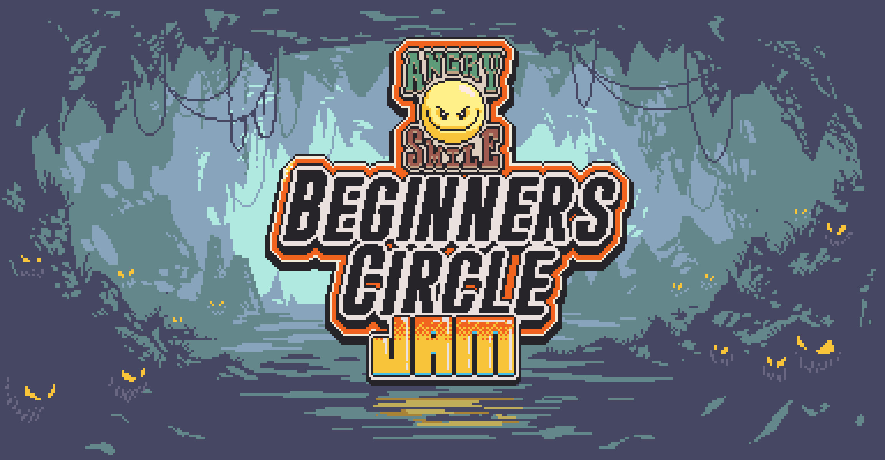

## Open Source Software Development

## Agile Project Management
Agile Project Management is a super useful procedure that software engineers do to get things done and to get them done fast and orderly. So Agile is basically coming together
as a group and identifying the problems that need to be solved for a program and to distribute these problems amongst team members. This can be done over in a collaborative 
github repository where people can create branches of the main project and add in their piece of code and as a team make changes to the master all at the same time. The code
them all combines at the master and produces the product the the software engineering team had set out on.

I have used Agile Project Management during my time in Software Engineering I at UH Manoa for my class project Campus Clearout Center. My team members and I had produced a
functional application where the UH Manoa community can sell their items for cash with other students, however this would mean there will be a lot of moving parts that need
to be addressed. We were able to efficiently produce a program by splitting up the responsibilities, producing a working application within 5 weeks. However as time went on
during the project different problems had come up and we had to act accordingly to answer those problems. We had also taken in criticisms to improve our application and we
had also split up the responsibilities to improve our program based off of the criticisms we got. Agile is a worth-while procedure that most software engineering teams should
follow.

## Ethics in Software Engineering
The ethical responsibilities of Software Engineers can not be overlooked and boundaries should be put in place when a user gives a website personal information. A general
summary of coding ethics is to keep the users safe by securing their personal information, and to produce work for the betterment of society.

During the development of my team's project Campus Clearout Center we had decided that only UH Manoa students should be able to see items listed for sale. The purpose of this
is to confirm that buyers are from the UH Manoa community and should be safe to meet up in that their identity is able to be confirmed as they have to sign up with the a
hawaii.edu email. Not only does this allow us to follow coding ethics 
