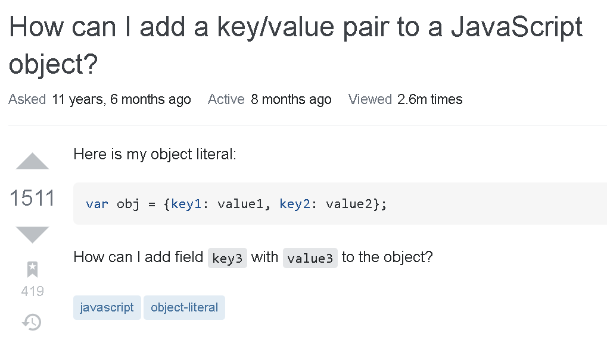

 *"Not all those who wander are lost..."*

# Finding a Way Out
Asking questions about programming is similar to finding your way out of a forest. In order to get out you need to know what direction you need to go in, otherwise you will just
head further into the forest. Figuring out the path you're going down in programming can be key to approaching problems, and understanding whether or not you're on the right path,
you need to figure out whats in your surroundings. After reading "[How To Ask Questions the Smart Way](http://www.catb.org/esr/faqs/smart-questions.html)," it can be said there are
good ways to approach problems than just asking "what happend." In order to get out of this metaphorical forest, we must first know how to help ourselves, and from there we can
move towards the right way.

## Good Questions: It's Okay to Be New
It is okay to ask seemingly "newbie" questions, just as long as you have done the preliminary searches. In order to ask the correct question, you need to know what you're working
with and do everything you need to do. Do not quit to ask a question at the first roadblock in the coding journey, because not only does it hinder your ability to critically think
in programming, it gives you a habitual reliance on asking questions to places like StackOverflow. In other words, the more you can do the better. However, no one is immune to times
where they are absolutely stumpted so they ask sources on how to improve one's code. This [question](https://stackoverflow.com/questions/1168807/how-can-i-add-a-key-value-pair-to-a-javascript-object) on StackOverflow provides a nice example on what a good question may look like.  



Above is the discussed question, and just by glancing at the question it appears that the user who posted the question knows what they're doing up to a degree, they just need a 
little push in the right direction. They use proper grammar, punctuation, and spacing. Not only that but they have completely identified their problem and made their post clear and succint. Although to some veteran javascript coders, this may look like quite a elementary problem. People are out there to help, just remember to be courteous to those that provide help, and do not be a nuisance. Your questions can also help others that may be stuck on similar problems.

## Bad Questions: A Lesson in What Not to Do
There are definitely sub-optimal ways to ask questions, but identifying the patterns that allows bad questions to exist will give insight into how they form. For one, people who
may post bad questions might not even know what they're working on, they might not be able to explain the process to how they got to where they are. Returning to the forest analogy 
from earlier, identifying landmarks and relaying it to the search team can definitely help them find you. Identifying landmarks would be similar to know the names of various things
in programming.

And another thing is to not ask questions that look straight out of a homework problem. The user of this [post](https://stackoverflow.com/questions/65943921/program-wont-print-out-amount-of-characters-that-are-in-a-file) does not seem to appear to know a thing about their work.

```
int main()
{
    ifstream indata;
    counterType intchar;
    cout << "What file would you like to read?" << endl;
    string filename = "empty"; 
    cin >> filename;
    indata.open(filename);
    return 0;
    countchar(intchar, indata);
    intchar.displayCounter();
}
```

This user also seems to exhibit the patterns of someone who may ask bad questions. Just at a glance of their code it does not take a professional  to a major problem in their code, that being the random "return 0" statement in the middle of the main. He does not even explain everything in his code, nor things he has already done to fix the problem. This user also seems to be posting what appears to be a question for their homework. This user is not using their critical thinking abilities to figure out why their code is not working. Which
makes them ask a bad question on a busy forum. Learn from the mistakes of others so that you do not make them, and we can learn a lot from this post.

## Exiting the Forest
Picking up the correct patterns to ask good questions will allow one to become a better programmer. In order to pick up the pattern, I have discussed that in order to ask good
questions you would need to explain what your code does and what it needs to to, that and proving that you know all the surrounding information and that you have done what could
be done to your knowledge. Going by these standards will prevent you from forming a dependency on asking for help and allow you to become a better programmer in general. This can
also be used outside of programming, applying critical thinking and then asking for help after everything has been done will surely provide great results for what you're working with
and any other future projects that may come along.
