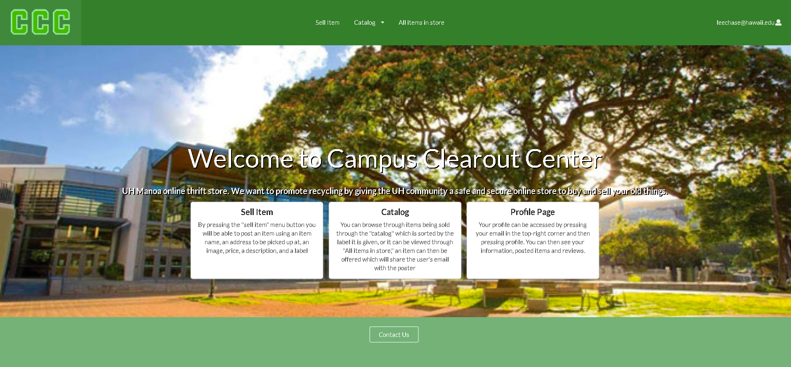
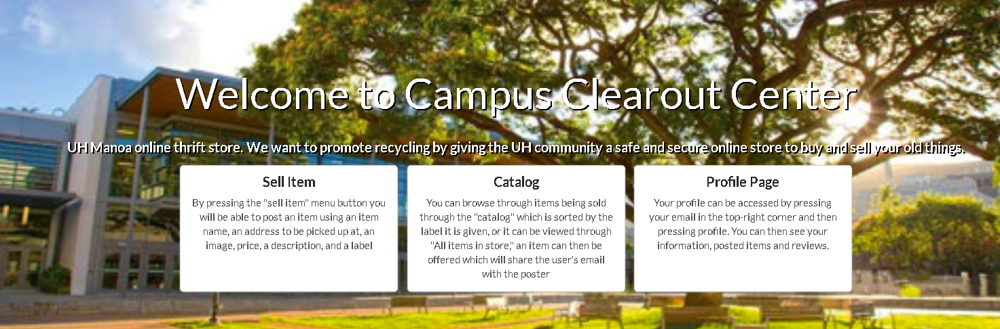
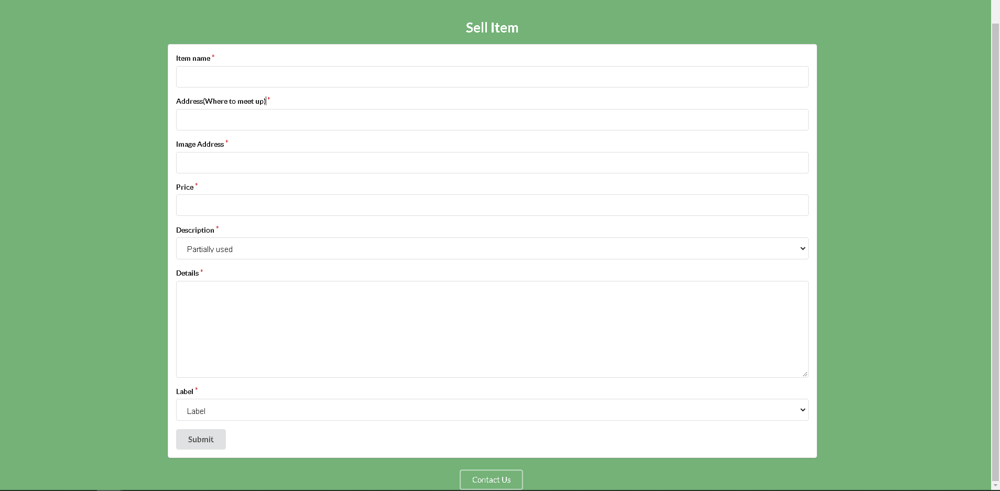
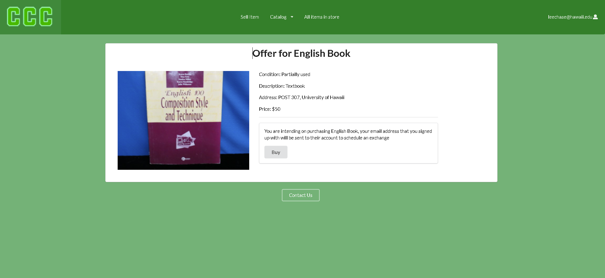
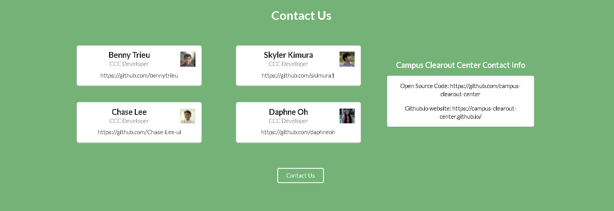

## Overview
Campus Clearout Center is a project that allows UH Manoa community members to buy items that other members of the UH Manoa community are willing to part with for a small sum
of cash. This program was made by the work of my teammates and I for an assigned project in out software engineering class.

## Contributions
I was an active contributed to this project as I had updated the general style of the website and made multiple pages.

I had made the stylistic choices across the website which means I had contributed to the style.css page and made visual improvements where there could be. But of course,
it is always function over appearance.

I had created the database system for selling an item and having that item appear on the catalog pages. So when a user logs in they can see three new tabs, in the "Sell Item"
tab they can find the form they need to fill out to create an item that will be posted on the catalog pages. The cards that the item appear in show all of the information
that was filled out in the form, however users are not allowed to change the fields of their name because they need to present items as themselves.

I had also created the offer item page, when a suer clicks on the blue offer button on the catalog page they will be redirected to the offer page where it displays all the
information confirming the item, and once they agree with the item's terms, then the email that they had signed up with will be sent to the user's profile page under the
buyer tab, and from this they can use their UH emails to have a conversation on the item and where to meet up.

My last contribution is the contact us page, although not a lot was a cute touch I wanted to put in. I had posted me and my group members name, role, and github accounts
to the form of cards, to the right of that I had posted the open source code and github.io website that can be viewed by anyone who has access to the Campus Clearout Center
website.

## The Experience
This project had been a great experience and I hope I get more projects like this in the future of my computer science courses. I had enjoyed the company of my teammates as
we had struggled together creating this website. This experience improved my ability to communicate with others and provide a better foundation for my problem-solving skills
in terms of coding and team-oriented projects.

The Organization GitHub Page associated with this project can be found [here](https://github.com/campus-clearout-center).

