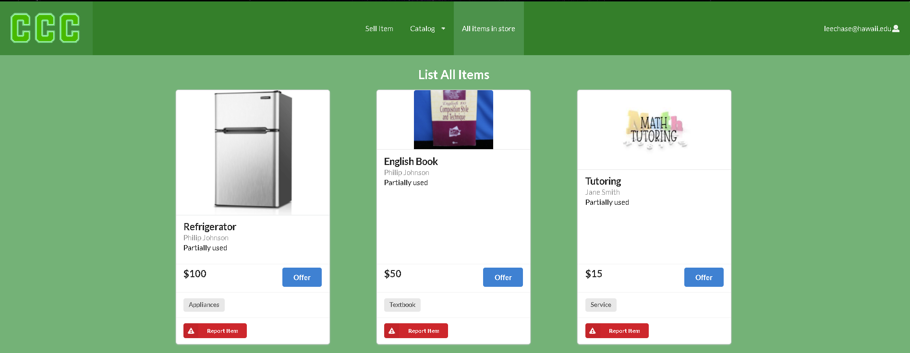

## Overview
Campus Clearout Center is a project that allows UH Manoa community members to buy items that other members of the UH Manoa community are willing to part with for a small sum
of cash. This program was made by the work of my teammates and I.

## Contributions
I was an active contributed to this project as I had updated the general style of the website and made multiple pages.

I had created the database system for selling an item and having that item appear on the catalog pages.

I had also created the offer item page

My last contribution is the contact us page, although not a lot was a cute touch I wanted to put in.

## The Experience

The Organization GitHub Page associated with this project can be found [here](https://github.com/campus-clearout-center).

