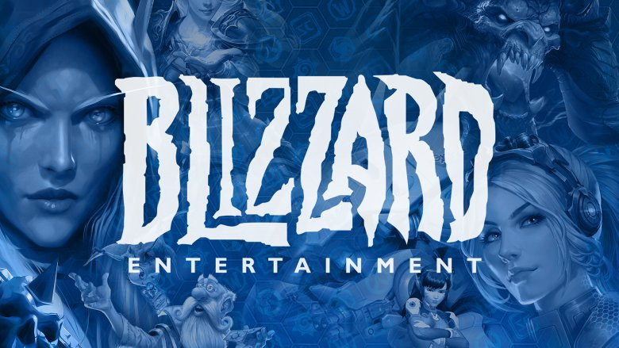

  
  

The UH Game Dev club includes talking about many topics about game design. This club helps lead students who have an interest in making games, whether they like coding or doing
art, down a pathway to follow. Meeting topics include game design workshop where club members collaborate to talk about different aspects of a game, how they work, and why they
work.

This club also networks to famous industries in game design. We have recieved recruiters from Blizzard and had a guest speaker from Riot Games. Both of these companies have a huge
reputation in the gaming industry. Club meetings are highly interactive, where officers only lead members through discussion which allows room for free thinking. The Game Dev Club
is a good community for those to meet others who have similar passions in gaming.

If you want to join the UH game dev club or would like to speak for the club, please contact me at leechase@hawaii.edu
